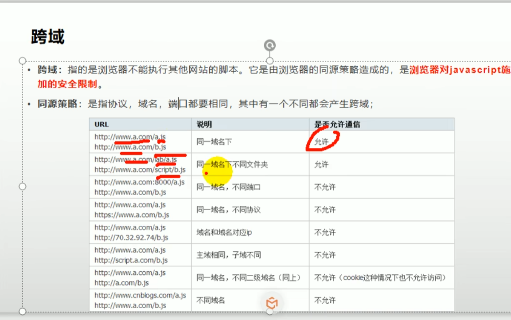

# 谷粒商城

## 网关

https://docs.spring.io/spring-cloud-gateway/docs/current/reference/html/

### 商品服务 三级分类

#### 配置网关路由与路径重写

配置网关路由：

1）在yml文件配置

应用模块：

```yaml
  cloud:
    nacos:
      discovery:
        server-addr:  127.0.0.1:8848
  application:
    name: gulimall-coupon
```

gateway模块：

```yaml
spring:
  cloud:
    gateway:
      routes:
        - id: test_route
          uri: https://www.baidu.com
          ##断言：如果url=百度，则跳转到uri
          predicates:
            - Query=url,baidu
        - id: test_route
          uri: https://www.qq.com
          predicates:
            - Query=url,qq
        - id: admin_route
          uri: lb://renren-fast
          predicates:
            - Path=/api/**
     ###路径重写：
          filters:
                            ###前面的路径变到后面的路径
            - RewritePath=/api/(?<segment>.*),/reneren-fast/$\{segment}        

```

跨域：




（利用网关)


（多用）逻辑删除：不是真的删除，而是用一个标志位表示是否删除

## nacos

#### 上传阿里云：


一

导入依赖

```java
<dependency>
			<groupId>com.aliyun.oss</groupId>
			<artifactId>aliyun-sdk-oss</artifactId>
			<version>2.8.3</version>
			<scope>test</scope>
</dependency>
```


```java
@Test
	public void testUpload() throws FileNotFoundException {
		// Endpoint以杭州为例，其它Region请按实际情况填写。
		String endpoint = "oss-cn-chengdu.aliyuncs.com";
// 云账号AccessKey有所有API访问权限，建议遵循阿里云安全最佳实践，创建并使用RAM子账号进行API访问或日常运维，请登录 https://ram.console.aliyun.com 创建。
		String accessKeyId = "LTAI5tJrGmaPFD8xr83vjTa5";
		String accessKeySecret = "ZSwtpyUmGWEHMKBoiCs2mZjWA51N7K";

// 创建OSSClient实例。
		OSS ossClient = new OSSClientBuilder().build(endpoint, accessKeyId, accessKeySecret);

// 上传文件流。
		InputStream inputStream = new FileInputStream("E:\\tx\\_20220418205259.jpg");
		ossClient.putObject("gulimall-liutianxu", "_20220418205259.jpg", inputStream);

// 关闭OSSClient。
		ossClient.shutdown();
		System.out.println("上传成功");
	}

```

第二种方法：

导入starter依赖

```java
<dependency>
		<groupId>com.alibaba.cloud</groupId>
		<artifactId>spring-cloud-starter-alicloud-oss</artifactId>
		<version>2.2.0.RELEASE</version>
</dependency>
```

在application中配置账号密码


然后就不需要再文件里配置了

：

```java
@Test
public void testUpload() throws FileNotFoundException {
		// Endpoint以杭州为例，其它Region请按实际情况填写。
//		String endpoint = "oss-cn-chengdu.aliyuncs.com";
//// 云账号AccessKey有所有API访问权限，建议遵循阿里云安全最佳实践，创建并使用RAM子账号进行API访问或日常运维，请登录 https://ram.console.aliyun.com 创建。
//		String accessKeyId = "LTAI5tJrGmaPFD8xr83vjTa5";
//		String accessKeySecret = "ZSwtpyUmGWEHMKBoiCs2mZjWA51N7K";
//
//// 创建OSSClient实例。
//		OSS ossClient = new OSSClientBuilder().build(endpoint, accessKeyId, accessKeySecret);
//
//// 上传文件流。
		/**
		 * 上面不需要了
		 */
InputStream inputStream = new FileInputStream("E:\\tx\\_20220418205259.jpg");
		ossClient.putObject("gulimall-liutianxu", "_20220418205259.jpg", inputStream);

// 关闭OSSClient。
		ossClient.shutdown();
		System.out.println("上传成功");
	}

```

### 表单校验：

对实体类的属性的校验


该类可以校验很多：

如@Email：必须为邮箱

@NotNull:不能为空

可以自定义校验：用@Pattren，里面是正则表达式


可自定义messege提示：


返回为R结果类：利用@Valid注解


#### 统一处理异常：


可以不接收异常，当发现异常时抛出去：


全部注释掉，建立一个 统一异常类：


状态码的设置建议规范：


#### 分组校验：


 


#### 自定义注解：

目的：


方法：


1）在所有valid注解的配置文件地址处自定义一个配置文件：


建类：


2）自定义注解器：自定义一个类实现接口Con...


3）关联：


## Nginx


在浏览器输入gulimall.com能转到192.168.56.1：10000

大致步骤：

1.浏览器输入gulimall.com：windows的host配置里指定了gulimall.com->（映射为）192.168.56.1(虚拟机地址)

2.虚拟机的nginx在监听80端口（浏览器默认端口），代理域名为gulimall.com，如下 


### nginx负载均衡

1.在nginx的http块中配置上游服务器，（nginx和服务之间通过网关代理。）


2.其次server块中负载均衡的配置：


3.网关配置：


注意：


### nginx动静分离


在nginx下建立一个static文件夹


将之前的静态资源替换成static文件夹下，同时删除之前的文件


从default配置文件中复制路径到nginx.conf文件里，配置路径


## 缓存

最简单map<key,value>

### 本地缓存

一致性问题：


解决：


### Redis


2）


主要用五大类型：


例子：


真正的业务逻辑：


会产生堆外内存溢出：OutOfDirectMemoryError


#### 高并发场景：

1.加本地锁：

每一个服务都有一把锁。


可以第一个拿到锁之后查数据库就将数据放入缓存。

2.分布式加锁


问题：死锁

解决：加过期时间

redis中有setnx:只有 没有时才set：


问题：加锁没有原子性，总会有加了之后就宕机使得无法加过期时间

解决：使得加锁和设置过期时间有原子性

redis中有setex：加锁时就设置过期时间，

既使用nx又使用ex


问题：删除锁的时候可能会删别人的锁：

业务代码太长，删除锁时锁已经过期被别人占用了

解决：uuid，判断是自己的拿的锁，再删


问题：执行完毕未过期并且此刻是自己的uuid，但是发送删除锁的请求的时候过期了，在此期间被其他人拿到，导致删除别人的锁

总之，删除锁没有原子性，对比uuid和删除锁是两步，不具有原子性

解决:解锁保证原子性


利用脚本语言


### redisson


Redisson的可重入锁RLock实现了java的lock接口

示例：


**Redisson不会死锁：**

1.它可以给锁自动续期（看门狗机制）

2.只要业务运行完成 ，默认30s会自动解锁


如果直接lock(),会有看门狗自动续期的机制

如果自定义lock($leastitme$)，没有自动续期

但建议使用第二种（时间给大一点）


### 读写锁

读数据必须等待写锁释放，否则一直阻塞

写锁


读锁：


### 闭锁


### 信号量：


**可以做限流**（只给10000个线程，多了就不给）

### 缓存一致性


更新数据库就删除对应缓存


**缓存数据**+*过期时间**已经能解决大部分需求


#### 中间件：Canal


经常读写会不好


#### Spring Cache


使用：


自定义配置：在config下自己写配置类


失效模式：


还有@CachePut：双写模式

SpringCache的不足：


### nginx检索服务


### 异步线程


七大参数：


最后的拒绝策略：默认是AbortPolicy，直接丢弃


应用：


几种常用的线程池：


#### CompletableFuture：异步编排


runAsync:


supplyAsync


supplyAsync好处：返回一个future，可以用很多方法


 完成回调和异常感知：


#### 最终处理：


#### 线程串行化：


加Async:再开一个新线程

不加：用同一个线程


#### 两任务组合：&&


例子：


thenCombineAsync


**叫run的方法都是直接执行，不感知之前的结果**

#### 两任务执行一个就执行：||


例子：


#### 多任务组合：


### 认证服务

#### 加密


自动盐值，判断：密码+数据库中的密码（一串）


#### 登录


#### session分布式

**一台服务器保存cookie,到其他的服务器下没有这个cookie了**

两方面：1.服务器水平扩展（负载均衡）2.子域的分布式问题（gulimall.product的session，在gulimall下就没有了）


解决：


用的最多：


2.子域问题：

**SpringSession**：


扩大cookie作用域


首先将发给浏览器的cookie的session放入后台redis

其次发session时其作用域扩大到全局，且session id是相同的

**springsession核心原理**：


多系统：多个不同域名的登录 


## RabbitMQ:

### 可靠投递

#### 发送端：


发送端确认：


队列确认：


#### 接收端：


用法：


## Feign远程调用丢失请求头：

同步:

异步：


解决：


## 分布式服务：

同类中传播行为失效：


